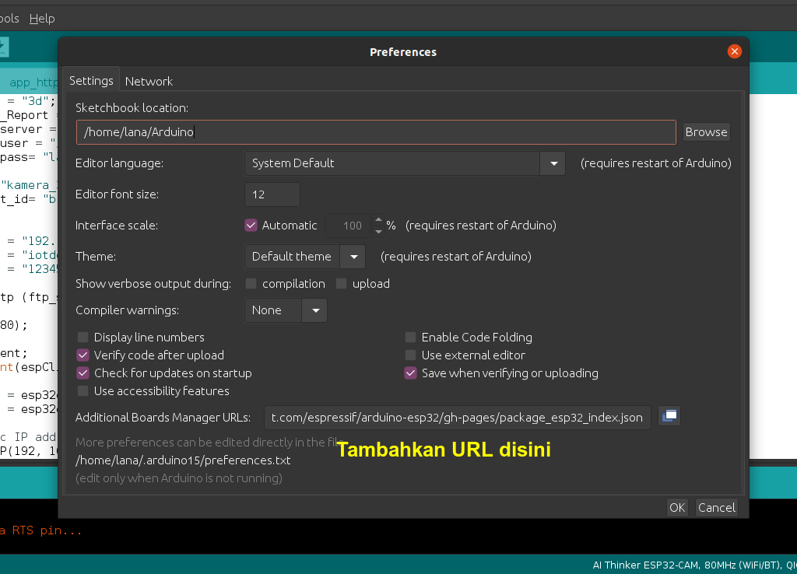
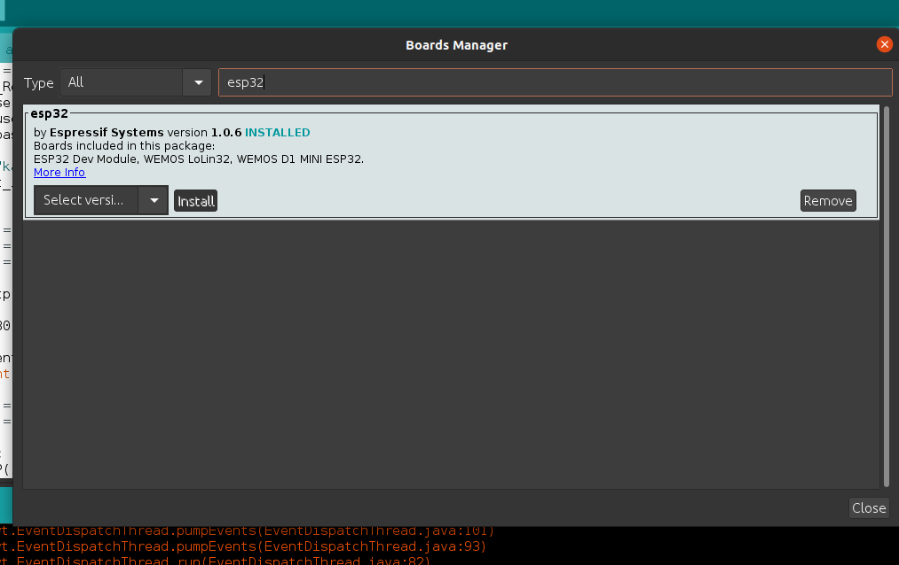
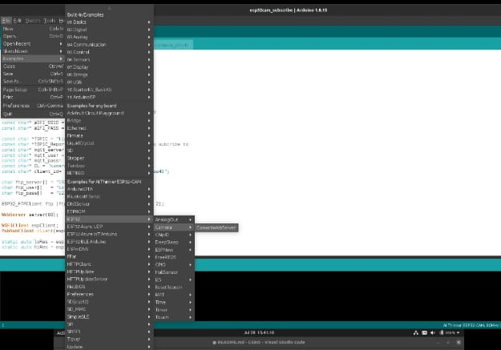
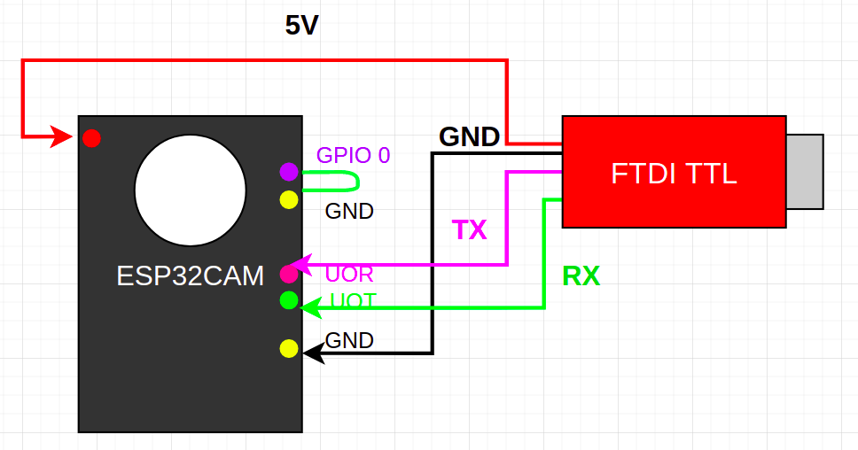
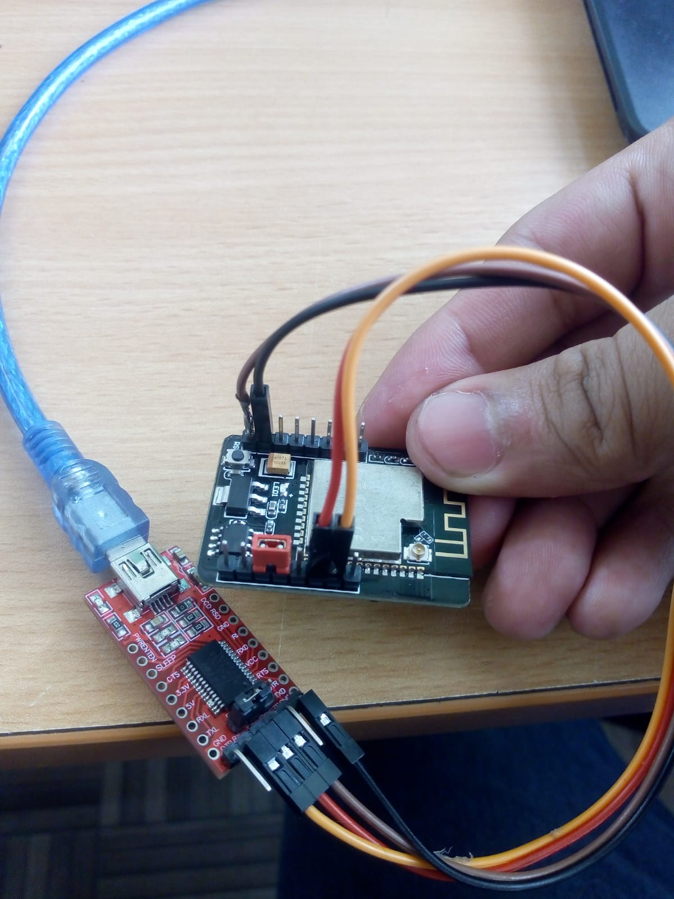

## ESP32CAM_BASE
___
### Langkah-langkah untuk menjalankan program base ESP32CAM
1. Download Libraries yang dibutuhkan disini :
https://drive.google.com/file/d/1CLGPRt8_l0wwoNG6AWUamMlCOkm427ZJ/view . Ekstrak .ZIP pada suatu folder.
2. Buka Aplikasi Arduino IDE. Lalu masukkan beberapa file library yang telah di download pada Arduino IDE. (Sketch -> Include Library -> Add .Zip library)
3. Pastikan Arduino IDE telah terinstal library ESP32 Board.  Jika belum, masukkan URL esp32.json pada Preference Arduino IDE. Caranya, buka Arduino IDE, lalu pilih __FILE -> PREFERENCES__. Lalu masukkan URL (https://dl.espressif.com/dl/package_esp32_index.json) ke kolom __Additional Boards Manager URLs__ seperti gambar dibawah ini :
Jika sebelumnya sudah terdapat URL untuk ESP8266, tambahkan jeda (koma) seperti pada konfigurasi dibawah. 
> https://dl.espressif.com/dl/package_esp32_index.json, http://arduino.esp8266.com/stable/package_esp8266com_index.json
4. Setelah URL ditambahkan maka selanjutnya ke menu __Tools -> Board -> Boards Manager__ lalu cari __esp32 by Espressif Systems__ seperti gambar dibawah. *Pastikan terkoneksi internet

5. Setelah semua tahap diatas selesai, restart arduino IDE. Lalu Buka program .ino yang ada pada __libbrary example__ seperti yang tercantum dalam gambar dibawah.

6. Lalu ganti pengaturan Wifi pada sketch program yang telah didownload seperti pengaturan ssid dan password.
7. Jika memakai __downloader ttl CH340__, maka silahkan download terlebih dahulu driver ch340 : https://sparks.gogo.co.nz/ch340.html . Namun jika menggunakan ftdi ttl (merah) tidak perlu.
8. Karena ESP32Cam tidak dilengkapi port untuk mendownload program, maka diperlukan usb ttl. Berikut wiring diagram dari usb ttl ke ESP32CAM untuk mendownload program. *ingat pin GPIO 0 harus disambungkan dengan GND agar bisa masuk mode flash.

9. Pilih Board AI Thinker ESP32CAM pada modul Board Arduino IDE. Pilih Baudrate 115200 untuk Serial Monitor.
10. Jika pada saat upload terkendala pada "connecting... to downloader" maka tekan tombol reset pada ESP32CAM,
11. Jika sukses, maka lepas GPIO 0 yang sebelumnya menyambung dengan GND. Lalu masuk Serial Monitor.
12. Tekan Reset pada ESP32CAM. Jika ESP32Cam tersambung dengan koneksi WiFi yang telah dikonfigurasi sebelumnya maka akan muncul IP yang diberikan pada ESP32CAM. 
14. Copy IP address ESP32CAM tersebut pada sebuah Browser. Lalu Pilih Start Stream pada tombol merah dibawah. 
____